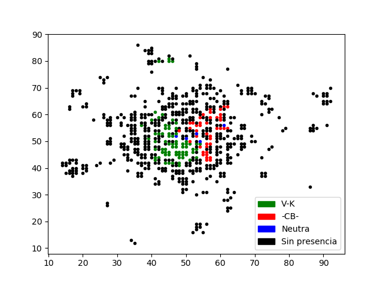

# ikariam

## Ban Elver Galarga pls, for unauthorized acces to the game's metadata

##### datos.py [-A|j]
#####  -A ejecuta todo el código.
#####  -j ejecuta únicamente la generación del dataframe (que guarda localmente como dataframe.csv).
#####  Sin argumentos ejecuta exclusivamente la parte interactiva del programa.

#### Actualmente la orden 19 genera un mapa reflejando el número de ciudades de datos alianzas dadas.

### SUGERENCIA: #### Implementar órdenes para mostrar listados de alianzas, ciudades,...
##### y permitir así el uso sin necesidad de estar en el juego.

